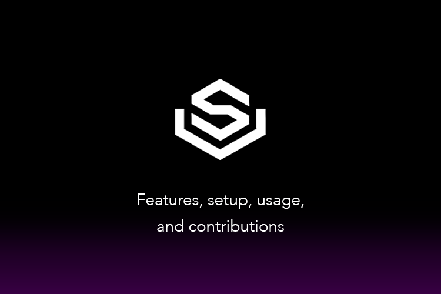

# SolVise

SolVise is an AI-powered analytics and advisory tool designed to help users optimize their blockchain wallets and activities on the Solana ecosystem. It combines advanced AI algorithms with blockchain insights to provide in-depth analytics, actionable recommendations, and transparent performance tracking. Whether you're an investor, NFT enthusiast, or developer, SolVise empowers you to make smarter decisions with your blockchain assets.

---

## Features

### Wallet Analytics
- Track wallet transactions, balances, and token performance in real time.
- Get detailed insights into portfolio growth and diversification.

### Actionable Recommendations
- Identify high-yield staking pools and liquidity pools.
- Discover new investment opportunities tailored to your portfolio.
- Optimize transaction timing to save on gas fees.

### NFT Insights
- Analyze the value, rarity, and trends of NFTs in your wallet.
- Receive recommendations on profitable selling, buying, or minting strategies.

### Smart Contract Monitoring
- Audit smart contracts for vulnerabilities and performance issues.
- Monitor usage metrics and uptime for deployed contracts.

### Security and Transparency
- Detect suspicious wallet activity.
- Log all insights and analyses securely on the Solana blockchain for transparency.

---

## Getting Started

### Prerequisites
- A Solana wallet (e.g., Phantom, Solflare).
- Basic understanding of blockchain and DeFi activities.

### Quick Start
1. Clone the repository
   ```bash
   git clone https://github.com/SolViseAI/SolVise.git
   cd SolVise
   ```

2. Install dependencies
   ```bash
   npm run install-all
   ```

3. Set up environment variables
   ```bash
   cp .env.example .env
   # Edit .env with your MongoDB URI and Solana RPC URL
   ```

4. Start the application
   ```bash
   npm start
   ```

### Requirements
- Node.js v14 or higher
- MongoDB
- Solana CLI tools (optional)

## Usage

1. Connect Your Wallet
- Log in with your Solana wallet

2. Dashboard
- View your wallet activity
- Access portfolio analysis 
- Get NFT insights

3. Receive Recommendations
- Get actionable insights
- Optimize staking and trading
- Improve portfolio performance

4. Explore Opportunities
- Discover high-potential tokens
- Find profitable pools
- Explore trending dApps

5. Secure Your Assets
- Audit smart contracts
- Monitor for suspicious activity
- Keep your assets safe

## Development Guide

### 1. Environment Setup
1. Install dependencies:
   - Solana SDK and JSON RPC API
   - TensorFlow or PyTorch
   - React.js and Node.js
   - MongoDB

2. Configure development environment:
   ```bash
   # Install Solana tools
   sh -c "$(curl -sSfL https://release.solana.com/v1.9.16/install)"
   
   # Install project dependencies
   npm install
   
   # Set up environment variables
   cp .env.example .env
   ```

### 2. Core Components Implementation

#### 2.1 Wallet Tracking
- Implement Solana SDK integration for wallet connections
- Create APIs for transaction and balance monitoring
- Set up real-time data processing pipeline

#### 2.2 AI-Driven Recommendations
- Train ML models using historical blockchain data
- Implement prediction algorithms for:
  - Token performance analysis
  - Staking opportunities
  - Portfolio optimization

#### 2.3 NFT Analysis
- Integrate Metaplex API for NFT data retrieval
- Implement rarity scoring algorithms
- Create value trend analysis system

#### 2.4 Smart Contract Monitoring
- Develop contract auditing system
- Implement vulnerability detection
- Create gas optimization analysis

### 3. Data Storage

#### Blockchain Storage
- Deploy Solana smart contracts for insight logging
- Implement Arweave integration for decentralized reports

#### Off-chain Storage
- Configure MongoDB schemas for user preferences
- Set up caching system for frequent queries

### 4. Security Considerations
- Implement wallet security checks
- Set up transaction monitoring system
- Deploy fraud detection algorithms

### 5. Testing and Deployment
1. Testing:
   ```bash
   # Run unit tests
   npm test
   
   # Run integration tests
   npm run test:integration
   ```

2. Deployment:
   ```bash
   # Build production version
   npm run build
   
   # Deploy to production
   npm run deploy
   ```

### 6. API Documentation
Detailed API documentation is available in the `/docs` directory.

## Technologies Used

- Solana Blockchain: For transaction data, storage, and smart contracts.
- AI/ML: Machine learning models for insights and predictions.
- Frontend: React.js for user interface.
- Backend: Node.js with Express for API and data processing.
- Database: MongoDB for user settings and off-chain storage.

## License

This project is licensed under the MIT License. See the LICENSE file for details.